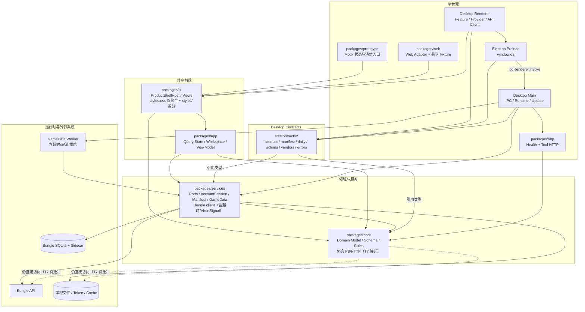

# d2-tools 系统架构复评（对照 2026-07-17 报告）

- 复评日期：2026-07-21
- 复评角色：高见远（Gao）· 架构师
- 仓库：`D:\sandrew\d2-service`
- 复评性质：**只读复评**，对照 `outputs/architecture-review-2026-07-17.md` 的 15 项发现逐项判断当前状态
- 对照方法：以旧报告 15 项基准为清单，逐项核查用户改动后（已提交到工作区，本次 `git status --short` 为空，全部改动已落地提交）的实际代码、配置与文档证据；不运行构建、测试、类型检查、安装或打包
- 基准报告整体分：**6.7 / 10**

> 重要上下文变化：旧报告评审的是“含大量未提交改动的 WIP 工作树”；本次复评的工作树已干净，迁移工作（契约收口、样式拆分、worker 超时、错误模型、fixture 拆分、preload CJS 重建等）已作为提交落地。`docs/todo.md`（更新于 2026-07-20）T6/T7 给出了明确的闭环状态与下一步。

## 1. 前后对比总表

| 旧编号 | 旧严重度 | 原结论 | 当前状态 | 证据（相对路径 + 符号/行号） | 新严重度 |
|---|---|---|---|---|---|
| P1-01 | P1 | core 含本地 FS/path/crypto 读写 + 重复 Bungie HTTP client | **未闭环（有进展）** | `packages/core/src/bungie/client.ts:17-82` 仍含真实 `fetch`（`:53`）；`account/summary.ts:1`、`daily/liveData.ts:1`、`weekly/liveData.ts:1`、`items/liveAvailability.ts:1`、`activities/history.js:1` 仍从 core client 取 `fetchBungieJson`；`core/src/index.ts:19` 仍导出。services client 已更成熟（`services/src/bungie/client.ts:54-58` 增加 `timeoutMs`+`AbortSignal`）。`app/test/multi-platform-boundaries.test.ts:17` 已加入 `bungie/client.ts` 架构护栏；`docs/todo.md` T7 将 “core 剩余 store/client” 列为**待迁** | P1 |
| P1-02 | P1 | IPC 契约多份真相 + preload/main 反向依赖 renderer | **已闭环** | `packages/desktop/src/contracts/{account,manifest,daily,actions,vendors,errors}.ts` 已建立；`contracts/account.ts:1-11` 仅引用 `@d2-tools/core`、`@d2-tools/services` 类型；`preload.ts:42,59,60,65,69,73` 全部从 `../contracts/*` 导入；`main/` 下 grep `renderer/api` 零命中；`renderer/api/accountApi.ts:1-15` 从 `../../contracts/account.js` 重导出 | — |
| P1-03 | P1 | styles.css 13,065 行物理单体 | **已闭环** | `packages/ui/src/styles.css` 现为 **30 行**聚合入口；`packages/ui/src/styles/` 拆分为 `foundation/shell/workspace/components/menus` 共 34 个分片 | — |
| P1-04 | P1 | 运行时/发布回滚链路缺目标环境实证 | **部分闭环** | `docs/todo.md` T6：代码、全仓回归、Windows NSIS 打包、隔离安装版、性能预算已完成；仅“下一次正式发版执行 Release workflow 与真实更新/回滚观察”待办。属“构建/打包已验证，真实回滚仍待 Release 观察” | P2 |
| P2-01 | P2 | account:summary 双重调用 | **已闭环** | `main/ipc/account.ts:27-39` 先构造单一 `summaryRequest` Promise，再让 `startBackgroundTask.run` 与 IPC 返回**共享同一 Promise**，不再二次 `loadAccountSummary()` | — |
| P2-02 | P2 | IPC 维护第二份账号 cache/index | **已闭环** | `main/ipc/account.ts` 已无 `latestAccountSummary`/`accountItemsByInstanceId`；仅转发 `getAccountSnapshot`/`getAccountItemDetailByInstanceId`（来自 `../runtime/accountSession.js`） | — |
| P2-03 | P2 | GameData worker 普通请求无超时/取消 | **已闭环** | `main/runtime/gameDataRuntime.ts:38-45` 按操作设超时（search/detail 15s、getDefinitions 30s、ping 5s）；`:145-153` 每请求 `setTimeout` 拒绝；`:220-231` 连续超时重启 worker；`:212` worker error/exit/close 统一拒绝清空；`:139-141` `suspended` 在资料库更新时 quiesce | — |
| P2-04 | P2 | 多处巨型业务聚合文件 | **未闭环（设计风险）** | 行数仍高：`account/summary.ts` 1617、`app/workspaces/vendorsPage.ts` 1189（原 1063）、`app/workspaces/libraryPage.ts` 874、`services/account/session.ts` 704、`services/manifest/lifecycle.ts` 663、`ui/home/HomePageContentView.tsx` 1200。注：原 `ui/i18n/copy.ts` 1229 行已拆分（见 P3-02） | P2 |
| P2-05 | P2 | Prototype/Web fixture 重复 + 版本漂移 | **已闭环** | 共享 fixture 基础已落地：`@d2-tools/ui/fixtures` 由 `prototype/src/mock/scenarios.ts:7`、`prototype/src/fixtures/usePrototypeFixtureRuntime.ts:23`、`web/src/webAdapter.ts:7`、`web/src/fixtures/useWebFixtureRuntime.ts:21` 复用；版本硬编码 `0.0.10` 已消失，`webAdapter.ts:36` 改用 `webAppVersion`，根 `package.json:3` 为 `0.0.13` | — |
| P2-06 | P2 | Desktop 生产源码深导入 app/src | **已闭环（生产）** | `renderer/utils/libraryFilters.ts:18-29` 现 `from "@d2-tools/app/library"`；grep `../../../../app/src` 在生产 `src` 零命中，仅 `desktop/test/*` 测试文件保留深导入（符合 AGENTS 对测试的放宽） | — |
| P2-07 | P2 | 构建/类型检查两套解析模式 | **部分闭环** | `scripts/build-preload.cjs` 已删除，`vite.preload.config.ts` 直接产出 CJS preload（消除字符串替换风险）；遗留的 renderer tsconfig 与 Vite alias 对齐、typecheck:desktop 与 desktop-fast 前置语义一致性仍为设计关注，未做运行时实证 | P3 |
| P2-08 | P2 | 自由文本错误模型 | **已闭环** | `contracts/errors.ts` 定义 `DesktopIpcErrorPayload{code,message,retryable,causeCategory}` 与按域分类器（account/home/manifest/gameData/writeAction），经 `D2_IPC_ERROR:` + JSON 信封传输；`main/ipc/account.ts:3-6,27-39` 用 `encodeDesktopIpcFailure(...)` 包装 | — |
| P3-01 | P3 | core 根入口重复导出 | **已闭环** | `core/src/index.ts` 现仅 `:43` 一处 `export * from "./manifest/metadata.js"`（旧报告 :43 与 :45 重复已消除） | — |
| P3-02 | P3 | ui 根入口 + i18n copy 聚合 | **部分闭环** | `ui/src/i18n/copy.ts` 由 1229 → **36 行**，现聚合 `copy/{shell,home,vault,loadouts,library,vendors,account,settings}.ts`；`ui/src/index.ts` 根入口聚合面仍偏宽（设计风险，无回归） | P3 |
| P3-03 | P3 | http package 边界简单 | **未闭环（设计风险，可接受）** | `http/src/server.ts` 仍仅 health / tools list / tool call，复用 `core/tools/registry`、`core/health`，无业务真相复制；旧报告所述“未成为完整 services composition layer”仍属前瞻设计关注，当前无问题 | P3 |

### 1.1 状态分布

- **已闭环（9 项）**：P1-02、P1-03、P2-01、P2-02、P2-03、P2-05、P2-06、P2-08、P3-01
- **部分闭环（3 项）**：P1-04、P2-07、P3-02
- **未闭环（3 项）**：P1-01、P2-04、P3-03

### 1.2 严重度汇总（当前待办项）

| 严重度 | 数量 | 说明 |
|---|---:|---|
| P0 | 0 | 仍无已确认的数据破坏、安全失守或发布阻断 |
| P1 | 1 | 仅剩 core 纯领域边界（FS/HTTP + 重复 client）未闭合 |
| P2 | 2 | P1-04 残留（真实回滚待 Release 观察）、P2-04 巨型文件 |
| P3 | 3 | P2-07 残留（alias 对齐）、P3-02 残留（ui 根入口）、P3-03（http 前瞻） |
| **合计** | **6** | 较旧报告 15 项显著收敛 |

## 2. 现状架构图（更新）

## 3. 三类结论区分

### 3.1 已确认修复（代码证据直接支撑，9 项）
P1-02（契约单一真相 + 消除反向依赖）、P1-03（CSS 物理拆分）、P2-01（Promise 共享消除双重调用）、P2-02（删除 IPC 第二缓存）、P2-03（worker 超时/取消/重启）、P2-05（共享 fixture 基础 + 版本漂移消除）、P2-06（生产深导入消除）、P2-08（typed IPC 错误信封）、P3-01（core 重复导出消除）。

### 3.2 仍存风险（代码显示仍在，需治理，3 项）
- **P1-01**：core 仍直接持有真实 `fetch` Bungie client 并被 core 领域代码使用，与 services client 形成两份实现（且已轻微分叉：services 有超时、core 无）。是剩余唯一 P1。
- **P2-04**：6 个 600–1600 行热点文件行数基本未变，仍是并行冲突与理解成本源。
- **P3-03**：http 包仍仅最小 transport，前瞻关注（无当前危害）。

### 3.3 仅文档意图尚未验证（需真实环境实证，3 项）
- **P1-04**：T6 已完成代码/全仓回归/NSIS 打包/隔离安装版/性能预算；“真实 Release 回滚观察”待下一次发版。
- **P2-07**：preload CJS 字符串替换已删除（代码确认），但 renderer tsconfig 与 Vite alias 解析策略一致性、typecheck 脚本前置语义未在干净 clone 下实证。
- **P3-02**：i18n copy 拆分已代码确认；ui 根入口聚合面偏宽仅为设计风险，无运行期影响。

## 4. 新发现清单（本轮改动引入或新观察到）

本轮改动以“收口边界”为主，**未引入 P0/P1/P2 级新问题**。仅以下 P3 级观察：

- **NEW-P3-1（契约对 services 内部子路径的依赖）**：`packages/desktop/src/contracts/account.ts:11` 从 `@d2-tools/services/account/snapshotStore` 取 `CachedAccountSnapshot`。虽为 `import type`，但契约层依赖了 services 的**内部**子路径而非公共 subpath；建议 services 暴露稳定的 `./account` 公共出口后改为公共路径，降低内部重构外溢。
- **NEW-P3-2（IPC 错误分类依赖中文消息子串匹配）**：`contracts/errors.ts:33-54` 等分类器用 `includesAny(message, [...])` 对中文消息做关键字匹配。若 services/领域层错误措辞变化，会静默回退到 `internal` 类。属旧报告 P2-08 推荐的“务实第一步”，建议中长期让 services 直接抛出携带 `code/causeCategory` 的 typed `ServiceError`，契约层只做信封转换而非关键字推断。
- **观察（非问题）**：`preload.ts` 仍暴露平铺 `window.d2` 并以 `as Promise<T>` 断言；因 T/P 三侧现统一引用 `contracts` 类型，漂移风险已大幅降低，保留现状符合“不一次性改 preload 暴露形态”的渐进策略。

## 5. 评分更新

整体架构评分：**6.7 / 10 → 7.8 / 10**（升 1.1）

| 维度 | 旧分 | 新分 | 升降 | 理由 |
|---|---:|---:|---|---|
| 分层与依赖方向 | 6.0 | 7.0 | ↑ | 契约收口、深导入消除、preload CJS 重建消除、core 纯度架构护栏已加；但 core 仍直接 FS/HTTP（P1-01 未闭环）拉住上限 |
| 跨端 UI 复用 | 8.5 | 9.0 | ↑ | styles 物理拆分、i18n copy 拆分、共享 fixture 基础落地，跨端一致性进一步增强 |
| Desktop / IPC 契约 | 5.5 | 8.0 | ↑↑ | 单一 `contracts` 真相、消除 preload/main 反向依赖、typed IPC 错误信封，是本轮最大改进 |
| 数据与运行时架构 | 8.0 | 8.5 | ↑ | worker 超时/取消/重启、account IPC 仅转发 session、构建/打包级回滚链路已完成；留真实 Release 回滚观察 |
| 可维护性与并行开发 | 5.5 | 6.5 | ↑ | 13k 行 CSS 单体拆分为 34 分片、i18n copy 拆分，消除最主要并行冲突面；但巨型 workspace/summary/session/lifecycle/HomePage 仍存 |
| 可测试性 | 7.0 | 7.5 | ↑ | 新增 core 纯度/契约架构护栏（multi-platform-boundaries.test.ts 引用 `bungie/client.ts`）；CI 对 core 纯度的强制门禁仍待 T7 落地 |

升分主因：9 项已闭环（尤其 P1-02、P2-03、P2-08 等结构性问题），并行冲突面（P1-03、P3-02）显著改善。未给到 8+ 的原因：P1-01（唯一 P1）仍活跃，P2-04 热点未拆，P1-04 真实回滚仍待 Release 观察。

## 6. 闭环路线图（剩余项渐进推进）

### 阶段 A：闭环唯一 P1（1 个迭代，优先）
- **P1-01**：按 `docs/todo.md` T7“再迁 core 剩余 store/client”推进。先让 core 领域代码（`account/summary.ts`、`daily/weekly/liveData.ts`、`items/liveAvailability.ts`、`activities/history`）改从 `@d2-tools/services/bungie/client` 取 HTTP；core `bungie/client.ts` 降为兼容 re-export 或删除；core 本地 store（wishlistStore、vault/tags、library/history、community-perks/*、actions/log、tools/audit、loadouts/templates、items/aliases）迁到 services。保留短期兼容 export。

### 阶段 B：降低并行/理解成本（可并行）
- **P2-04**：按稳定职责拆 6 个热点（summary 的 DTO/定义收集/快照装配/详情装配；workspace 的 normalizer/selector/filter/format/action planning；session 的 cache policy/in-flight/patch；lifecycle 的 download-verify/candidate-activate/recovery），保留 public export。
- **P3-02**：`ui/src/index.ts` 随真实消费者需要再增 UI subpath，不强制立即收缩。
- **P2-07**：将 Vite aliases 与 renderer tsconfig paths 统一由同一生成配置维护，明确每条链路解析策略。

### 阶段 C：真实环境实证（发版时）
- **P1-04**：下一次 `git-auto-release.cmd` 执行后，观察真实更新/回滚路径；稳定 Release 后清理 JSON/旧 IPC/旧 core HTTP 兼容层。

### 阶段 D：前瞻（按需，不急）
- **P3-03**：仅当 http 包承载真实 Web/API endpoint 时，再注入 services 并补请求限制与 typed error mapping。

## 7. 不建议现在做的过度优化（延续旧报告，仍成立）

1. 不重写为微服务/多仓库；边界问题在 package 内与 Electron 契约层。
2. 不一次性搬迁 core 全部文件；先禁新增泄漏，再按 T7 顺移 IO/HTTP。
3. 不引入 Redux/XState/全局事件总线；当前是状态 owner 重叠问题。
4. 不把 IPC 改重量级 RPC 框架；typed `contracts` + 高风险输入校验已足够。
5. 不把 CSS 迁 CSS-in-JS；物理拆分已解决主要冲突。
6. 不为每个 workspace 再建 package；先在 app 内按职责拆模块。
7. 不消灭 fixture；统一到 `@d2-tools/ui/fixtures` 即可。
8. 不在普通 CI 设机器相关绝对性能断言。
9. 不立即收紧所有根入口；先修生产深导入与契约多份真相。

## 8. 本轮未执行、需后续验证

- 未运行 `pnpm build` / `pnpm test:*` / `pnpm typecheck` / 打包 / 安装。
- 未运行 Desktop/Prototype/Web dev 或视觉脚本，未生成 unpacked/NSIS。
- 未做安装版、覆盖安装、自动更新或 Release 回滚的真实演练（P1-04 残留项）。
- 未连接真实 Bungie 账号/API，未下载/激活/回滚真实 Manifest SQLite。
- 未验证 worker 卡死、主进程崩溃、激活中断等故障注入。
- 未验证 `typecheck:desktop` 与 `desktop-fast` 在干净 clone（无历史 dist）下的一致性（P2-07 残留项）。
- 仅基于已提交工作树的静态源码、配置与文档证据；未运行任何自动化验证。

## 9. 最终结论

相比 2026-07-17，本仓库在**边界收口**上取得决定性进展：Electron IPC 已有单一 `contracts` 真相并消除反向依赖（P1-02），13k 行 CSS 单体与 1.2k 行 i18n copy 已物理拆分（P1-03/P3-02），`account:summary` 双重调用与 IPC 第二缓存已消除（P2-01/P2-02），GameData worker 已具备超时/取消/重启（P2-03），自由文本错误已升级为 typed IPC 信封（P2-08），生产深导入已消除（P2-06），版本漂移与 fixture 重复通过共享 `@d2-tools/ui/fixtures` 收口（P2-05），core 重复导出已消除（P3-01）。整体由 **6.7 → 7.8 / 10**，P1 由 4 项收敛为 1 项。

唯一剩余的 P1 是 **core 纯领域边界**（P1-01）：core 仍直接持有真实 `fetch` Bungie client 并被自身领域代码使用，与 services client 形成两份分叉实现；该迁移已在 `docs/todo.md` T7 明确列为“待迁”，且已加架构护栏。只要按阶段 A 完成 core store/client 迁移，并在下次发版完成真实回滚观察（P1-04），系统可在不重写的前提下稳定进入 8+ 分架构。

## 10. 实施跟进（2026-07-21）

本报告完成后已按其前三项治理建议收口：

- core 的真实 Bungie HTTP client 已删除。账号、日常、周常和实时来源读取只接收注入的 `BungieJsonFetcher`；services 统一 client 负责真实 HTTP、超时、取消和结构化错误。
- 六个热点文件已各自抽出稳定职责模块：账号定义收集、账号快照补丁、Manifest 文件处理、商人身份归一化、首页图标生成和资料库文本辅助。原调用入口保持兼容。
- services 已提供可抛出的 `D2ServiceError`，Desktop IPC 改为只按稳定 `code` 与 `causeCategory` 映射，不再根据中文错误文案猜测分类。

因此 P1-01 中的 HTTP 重复 client 已闭环；T7 剩余的是 core 本地 store 迁移、宽松 fixture 收口及 CI 验证。P2-04 的热点模块仍可随业务继续细化，但不再把网络、补丁、文件、身份、图标和文本职责混在同一文件中。
