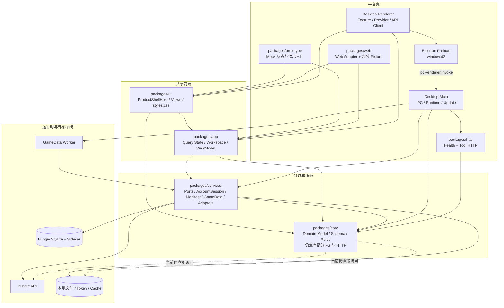

# d2-tools 系统架构评审

- 评审日期：2026-07-17
- 评审角色：高见远（Gao）· 架构师
- 仓库：`D:\sandrew\d2-service`
- 评审方式：只读源码、配置、文档与 Git 工作区检查
- 自动化验证：**未运行构建、测试、类型检查、格式化、安装或打包命令**

> 本报告评审的是当前工作区快照，而不是仅评审最新提交。评审时 `git status --short` 显示大量用户未提交修改和新增文件，主要集中在 Runtime、Account Session、GameData、Manifest 生命周期、Renderer store 与相关测试。报告没有回退、格式化或改动这些内容。

## 1. 执行摘要

当前仓库已经形成较清晰的目标分层：`core -> services -> app -> ui -> platform shells`，并且跨端 UI 的核心路线已经实际兑现。Prototype、Web、Desktop 三端均消费 `ProductShellHost` 和 `packages/ui` 的产品样式，Desktop renderer 的菜单 feature 隔离、`shared/` 依赖方向、`api/client.ts` 与 `ipc.ts` 的聚合职责也基本遵守文档约定。近期引入的 SQLite Manifest 生命周期、长生命周期查询 worker、`RuntimeCoordinator`、`AccountSession`、请求合并和局部 patch，说明系统已经从“页面直连平台能力”向“运行时服务与领域工作区”演进。

但当前实现仍处于迁移中段，主要矛盾不是缺少更多抽象，而是**已有边界没有完全闭合**：

1. `packages/core` 仍直接包含本地文件读写和真实 Bungie HTTP client，与正式文档定义的纯领域边界冲突；同一 Bungie client 已在 `packages/services` 再实现一份。
2. Electron IPC 契约仍分散于 renderer API、preload 和 main handler，preload/main 甚至反向导入 renderer API 类型；Account、Manifest、Daily、Action patch 等 DTO 存在多份平行真相。
3. `packages/ui/src/styles.css` 已达 13,065 行，虽然“唯一产品样式入口”的跨端原则是正确的，但物理单文件已经成为多人并行开发的主要冲突源。
4. 新运行时链路本身设计较成熟，但开发版、打包版、安装版和 Release 回滚演练尚未完成；查询 worker 普通请求也没有超时/取消语义。
5. 业务逻辑确实从 Desktop 下沉到了 `app/services`，但在新层内形成了多处 600～1,600 行的聚合热点，需要按稳定职责渐进拆分，而不是再做一次 package 级重构。

### 1.1 严重度汇总

| 严重度 | 数量 | 判断 |
|---|---:|---|
| P0 | 0 | 未发现已确认的数据破坏、安全失守或发布阻断问题 |
| P1 | 4 | 分层纯度、IPC 契约、共享样式冲突面、发布/回滚验证缺口 |
| P2 | 8 | 缓存与任务重复、worker 韧性、深路径耦合、巨型模块、fixture 漂移、构建解析和错误模型 |
| P3 | 3 | 聚合入口、HTTP 层成熟度和小型维护问题 |
| **合计** | **15** | 以渐进治理为主，不建议大爆炸重构 |

### 1.2 整体评分

**整体架构评分：6.7 / 10**

| 维度 | 评分 | 说明 |
|---|---:|---|
| 分层与依赖方向 | 6.0 | 目标清晰，`app/ui` 边界较好，但 core 仍有 IO/HTTP 泄漏，Desktop 存在源码深路径依赖 |
| 跨端 UI 复用 | 8.5 | 三端共享 `ProductShellHost`、页面 View 和产品 CSS，边界已真实兑现 |
| Desktop / IPC 契约 | 5.5 | 已按领域拆文件，但契约多份定义、preload 反向依赖 renderer、全量 `window.d2` 权限面较宽 |
| 数据与运行时架构 | 8.0 | SQLite、AccountSession、Broker、RuntimeCoordinator、回滚和 worker 隔离方向成熟 |
| 可维护性与并行开发 | 5.5 | 多个巨型文件和高冲突聚合点，尤其是 13k 行 CSS、core account summary 和 app workspace |
| 可测试性 | 7.0 | 有 memory adapter、架构测试和运行时专项测试，但部分架构规则只覆盖 `app/services/ui`，未覆盖 core 纯度和跨 package `/src/` 深导入 |
| 部署与发布架构 | 6.0 | electron-builder/NSIS/GitHub publish 链路存在，但安装版和回滚路径尚未完成实证验证 |

## 2. 评审范围与判断标准

### 2.1 已检查的正式约定

- `AGENTS.md`
- `docs/todo.md`
- `docs/development.md`
- 根 `package.json`、`pnpm-workspace.yaml`、`tsconfig.base.json`
- `packages/core`、`services`、`app`、`ui`、`prototype`、`web`、`desktop`、`http` 的 package 配置、入口和关键边界文件
- Desktop renderer API、preload、IPC、runtime、worker、打包配置
- Git 工作区状态和只读源码搜索

### 2.2 问题状态定义

- **已确认问题**：当前源码中可直接定位到与正式约定不一致、重复实现、数据漂移或明确韧性缺口。
- **设计风险**：当前实现可以工作，但结构会放大并行冲突、错误传播、扩展成本或运行时故障影响。
- **仅文档意图尚未验证**：文档或待办声明了目标/完成状态，但本次因禁止运行构建、打包、安装、性能诊断而不能确认实际行为。

## 3. 现状架构图



### 3.1 目标依赖方向与当前偏差

目标主链路应保持：

```text
core（纯领域）
  ↑
services（端口与运行时 adapter）
  ↑
app（跨端 workspace / ViewModel）
  ↑
ui（共享 React UI）
  ↑
prototype / web / desktop（平台 composition root）
```

当前主要偏差：

- `core` 对 Node 文件系统、路径、加密和网络存在实际运行时依赖。
- preload/main IPC 契约依赖 `desktop/src/renderer/api/*`，形成平台内部的反向类型依赖。
- Desktop 生产源码存在直接导入 `packages/app/src/workspaces/*` 的深路径。
- Web 除首页 snapshot 外仍大量由 fixture runtime 提供产品数据，Web services adapter 尚未闭合。

## 4. 已实现的架构优点

### 4.1 跨端产品壳已经真实共享

- `packages/ui/src/product/ProductShellHost.tsx:13` 定义统一 Host，并在 `:76-100` 内组合 `AppShell`、`ProductWorkspacePage`、`ProductWorkspaceHeader` 和 `renderPage(...)`。
- Prototype 在 `packages/prototype/src/main.tsx:155` 使用 `ProductShellHost`。
- Web 在 `packages/web/src/main.tsx:114` 使用同一 Host。
- Desktop 在 `packages/desktop/src/renderer/pages/HomePage.tsx:19` 使用同一 Host。
- Prototype、Web 和 Desktop renderer 分别导入 `@d2-tools/ui/styles.css`；Desktop 私有 `src/renderer/styles.css` 没有复制产品页面样式。

**判断**：`packages/ui` 与三个平台壳的共享边界不是文档愿景，而是已经落地的架构事实。

### 4.2 app 分域入口较克制

- `packages/app/package.json` 提供 `./account`、`./assistant`、`./home`、`./items`、`./library`、`./loadouts`、`./settings`、`./vault`、`./vendors` 等 subpath exports。
- `packages/app/src/index.ts` 仅导出通用 `QueryState`、`idleQuery`、`runQuery`，符合 `docs/development.md:76` 的约定。

**判断**：业务能力没有重新塞回 app 根入口，依赖面控制正确。

### 4.3 Renderer feature 隔离当前基本兑现

只读搜索未发现：

- `packages/desktop/src/renderer/features/` 中 feature 直接 import 另一个 feature。
- `packages/desktop/src/renderer/shared/` 反向 import `features/`。

`packages/app/test/multi-platform-boundaries.test.ts` 也对 app、services、ui 的平台依赖建立了架构护栏。

### 4.4 RuntimeCoordinator 和 Manifest 激活流程方向成熟

当前 runtime 组合已经覆盖：

- Manifest recovery 与 SQLite runtime 初始化。
- 账号 cache/warmup。
- generation/epoch 失效控制。
- Manifest 激活前 quiesce Account Session 和查询 worker，完成或回滚后 resume。
- 候选激活、finalize、rollback、startup recovery。

这与 `docs/development.md:206-212` 的正式目标基本一致。相比直接在 IPC handler 中切换目录或重建连接，当前设计显著降低了数据库文件切换时的并发风险。

### 4.5 AccountSession 是当前较成熟的数据访问抽象

`packages/services/src/account/session.ts` 已实现：

- snapshot、membership/profile、item detail 多级缓存。
- TTL 和 in-flight 请求合并。
- session epoch，防止失效请求写回新会话。
- detail cache 容量控制。
- 写操作成功后的局部 patch 和后台 revalidate。

这符合 `docs/development.md:210-211` 所述“列表紧凑快照、详情按需加载、写后局部 patch、后台校验”的方向，也比页面各自维护 fetch/cache 更易测试和演进。

### 4.6 SQL 和表结构被 Catalog/worker 隔离

- `packages/services/src/gameData/catalog.ts` 暴露最小 `GameDataCatalog`。
- `packages/desktop/src/main/runtime/gameDataRuntime.ts` 通过 worker 请求协议持有长生命周期查询通道。
- Renderer、app、ui 不直接执行 SQL。

这是正确的存储抽象边界，可避免 SQLite 表结构扩散到页面和 IPC。

### 4.7 发布配置具备基本闭环

`packages/desktop/electron-builder.yml` 已明确：

- `asar: true`
- Windows x64 NSIS
- 可选择安装目录
- GitHub publish provider
- 固定 artifact 命名

说明发布架构并非缺失；当前主要问题是验证证据不足，而不是没有配置。

## 5. P0 发现

**本次未发现 P0。**

未观察到已确认的密钥泄漏、Electron `nodeIntegration: true`、`contextIsolation: false`、无保护的任意协议执行、数据库激活前直接删除旧库等立即阻断项。Desktop 创建窗口时使用 `contextIsolation: true` 和 `nodeIntegration: false`，基础安全方向合理。

## 6. P1 发现

### P1-01 `core` 纯领域边界尚未闭合，且 Bungie HTTP client 重复

- 状态：**已确认问题**
- 影响维度：分层、可移植性、测试、重复实现

**证据**

正式约定：

- `docs/development.md:31-41` 明确 `core` 不承接本地文件、HTTP、OAuth callback server 或 cache adapter；网络、存储、鉴权应收口到 `services`。

当前实现：

- 以下 core 文件直接导入 `node:fs` / `node:path` / `node:crypto`：
  - `packages/core/src/actions/log.ts:1-3`
  - `packages/core/src/vault/tags.ts:1-2`
  - `packages/core/src/items/aliases.ts:1-2`
  - `packages/core/src/loadouts/templates.ts:1-3`
  - `packages/core/src/library/history.ts:1-2`
  - `packages/core/src/analysis/wishlistStore.ts:1-2`
  - `packages/core/src/analysis/targetRulesStore.ts:1-2`
  - `packages/core/src/tools/audit.ts:1-3`
  - `packages/core/src/community-perks/personalWeaponKnowledge.ts:1-2`
  - `packages/core/src/community-perks/localCommunityRecommendations.ts:1-2`
  - `packages/core/src/community-perks/aiLightggSource.ts:1-2`
- `packages/core/src/bungie/client.ts:16-38` 和 `packages/services/src/bungie/client.ts:16-38` 同时定义 `fetchBungieJson`、`postBungieJson`、`requestBungieJson`，实现结构基本相同。
- `packages/core/src/config/defaults.ts` 的 `node:path/node:os` 是文档明确允许的平台感知默认目录 helper，不应与上述 store/HTTP 泄漏等同处理。

**影响**

- core 无法作为浏览器、移动端或纯函数测试的稳定领域底座。
- 同一网络错误、header、base URL 和请求行为存在两份实现，修复容易不同步。
- Desktop/main 继续从 core 直接调用 store，会绕过 services 端口，削弱依赖倒置。

**渐进建议**

1. 先停止在 core 新增任何 IO/HTTP 实现，并加架构测试拦截 `node:fs`、真实 `fetch` 和 adapter 命名。
2. 以调用频率为序，将 `bungie/client.ts` 只保留在 services；core 仅保留 Bungie response 类型、纯转换和错误分类值对象。
3. 再按领域迁移 store：先迁写操作相关的 action log、vault tags、aliases，再迁 wishlist/target rules/community cache。
4. 保留原 subpath 的短期兼容 re-export，并在至少一个稳定 Release 后清理，不进行一次性目录搬迁。

### P1-02 Electron IPC 契约存在多份真相和反向类型依赖

- 状态：**已确认问题**
- 影响维度：IPC、DTO 所有权、运行时安全、可演进性

**证据**

- `packages/desktop/src/preload/preload.ts:43-46` 从 `../renderer/api/` 导入 `VendorInventoryRequest`、`CachedAccountSummary`、`HomeBriefing`、`ManifestStatusRequestOptions`。
- `packages/desktop/src/main/ipc/vendors.ts:5` 也从 renderer API 导入 `VendorInventoryRequest`。
- preload 在 `:160-304` 暴露一个平铺的 `window.d2`，大量调用仅通过 `as Promise<T>` 断言 handler 返回值。
- `packages/desktop/src/renderer/api/accountApi.ts:20-76` 手工定义 `AccountSummary`、`CharacterSummary`、`AccountMaterialSummary`，而 core 已拥有账号领域 DTO。
- `packages/desktop/src/renderer/api/manifestApi.ts:35-60` 定义 renderer `ManifestStatus`，core/services 也有相应状态模型。
- `packages/desktop/src/renderer/api/dailyApi.ts:43-63` 定义 `DailySummary`，preload/main 又使用 core 的同名领域类型。
- `packages/desktop/src/renderer/api/actionsApi.ts:84-105` 的 `AccountItemActionPatch` 与 services Account Session 的 patch 语义平行；preload 中还有写操作输入/结果声明。

**影响**

- renderer、preload、main 任一侧调整字段时，TypeScript 无法保证三侧同时更新。
- preload 依赖 renderer 层，使契约层次倒置；未来增加第二 renderer、测试 harness 或移动桥接时无法独立复用。
- `as Promise<T>` 只改变编译期视图，不能防止 handler 返回陈旧结构或不可信值。
- 全量 `window.d2` 使任一 renderer feature 在类型上可访问所有平台能力，权限和测试替身粒度过宽。

**渐进建议**

1. 在 Desktop 内新增不依赖 renderer/main 的共享契约目录，例如 `src/contracts/<domain>.ts`；先迁 Account、Manifest、Action 三个变化最频繁领域。
2. renderer API、preload、main handler 同时从该契约导入；禁止 preload/main 从 `renderer/` 导入。
3. IPC channel 以 typed map 表达 `channel -> input -> output`，先做编译期单一真相；仅对跨信任边界和高风险写操作逐步增加运行时 schema 校验。
4. 保留 `AppApi` 聚合给 `window.d2`，但 renderer feature 通过分域 adapter/hooks 注入最小接口，不要求一次性改变 preload 暴露形态。

### P1-03 唯一产品样式入口已经演变为极高冲突物理单体

- 状态：**设计风险**
- 影响维度：多人并行、UI 可维护性、回归定位

**证据**

- `packages/ui/src/styles.css` 当前为 **13,065 行**。
- `AGENTS.md:71-88` 和 `docs/development.md:126-165` 明确允许不同菜单并行改各自前缀样式，但所有规则仍落在同一物理文件。
- `AGENTS.md:51` 将 `packages/ui` 列为高冲突共享范围。

**影响**

- 逻辑上按 `.home-*`、`.vault-*`、`.library-*` 分域，Git 层面仍集中在一个文件，并行修改、排序和冲突解决成本高。
- token、shell、workspace chrome 和菜单内容规则难以单独审阅。
- CSS 级联问题和暗色回归难以定位到具体模块。

**渐进建议**

保持“一个对外产品样式入口”的架构语义，但拆分物理文件：

```text
packages/ui/src/styles/
  tokens.css
  shell.css
  workspace.css
  components.css
  menus/home.css
  menus/account.css
  menus/vault.css
  ...
packages/ui/src/styles.css   # 仅按稳定顺序 import
```

第一阶段只做等价搬迁，不重命名 class、不改选择器、不引入 CSS-in-JS。后续再为 token 和共享 chrome 建最小视觉回归基线。

### P1-04 新运行时与发布回滚链路仍缺少目标环境实证

- 状态：**仅文档意图尚未验证 / 设计风险**
- 影响维度：部署、升级、数据可用性、运维

**证据**

- `docs/todo.md:25` 明确记录 T6 已实现 SQLite 主链路、Account Session、Broker、分阶段启动、回滚等，但仍需：
  - Desktop 开发版验证
  - 打包版验证
  - 安装版验证
  - Release 回滚演练
  - 迁移后性能预算
  - 稳定 Release 后清理遗留兼容
- `packages/desktop/electron-builder.yml:1-30` 已有 NSIS/GitHub 发布配置。
- `packages/services/src/manifest/lifecycle.ts` 将下载、解压、校验、索引、候选激活、finalize、rollback 和 recovery 集中在一条关键链路。

**影响**

- 目录 rename、asar 路径、应用数据目录、更新覆盖、进程退出时机在开发环境和安装环境可能不同。
- 未做崩溃点演练时，不能仅凭单元测试证明 pending activation 和 rollback 在真实安装版可靠。
- 缺乏性能预算会使新的 SQLite/sidecar 优化无法形成回归门槛。

**渐进建议**

1. 建立发布前的固定矩阵：dev、unpacked、NSIS clean install、覆盖安装、离线启动、Manifest 激活中断、回滚。
2. 给关键阶段记录结构化诊断：候选路径、active version、pending/finalized、worker close duration、rollback result。
3. 只把确定性行为放普通 CI；绝对耗时和内存阈值保留在 Release/专项诊断，符合 `docs/development.md:212`。
4. 完成一个稳定 Release 和一次回滚演练后，再移除旧 JSON 兼容路径。

## 7. P2 发现

### P2-01 `account:summary` 重复表达前台请求与后台任务生命周期

- 状态：**已确认问题**

**证据**

`packages/desktop/src/main/ipc/account.ts:31-42`：

- 先 `startBackgroundTask(... run: loadAccountSummary)`。
- 随后直接 `return loadAccountSummary()`。

AccountSession 的 in-flight 合并可能避免两次真实网络请求，但上层仍创建了两个调用者生命周期。

**影响**

- 背景任务和前台调用可能重复记录完成、失败和耗时。
- 如果未来 freshness key、session key 或调用参数不同，去重假设可能失效。
- UI 收到请求失败时，后台任务仍可能继续或产生不同状态。

**建议**

创建一个 promise，由 background task 和 IPC response 共享；或者由前台请求本身注册任务状态，不再二次调用 service。

### P2-02 IPC account 层维护第二份 snapshot/index 真相

- 状态：**设计风险**

**证据**

- `packages/desktop/src/main/ipc/account.ts:19-20` 定义 module-level `latestAccountSummary` 和 `accountItemsByInstanceId`。
- `:78-100` 从完整 summary 重新构建 instance -> detail query 索引。
- services `AccountSession` 已维护 snapshot、detail cache、invalidate 和 patch 生命周期。

**影响**

- 写操作 patch、session invalidate、账号切换后，IPC 索引可能与 AccountSession 状态不同步。
- item detail 是否可查依赖“最近一次 IPC summary 是否缓存过”，而不是 session 的规范化状态。

**建议**

将 instance query 索引作为 AccountSession snapshot 的派生 selector，或把“按 instanceId 获取详情”直接定义为 session 能力；IPC 只转发，不再持有第二份账号状态。

### P2-03 GameData worker 普通请求没有 timeout、cancel 和单请求清理

- 状态：**已确认问题**

**证据**

- `packages/desktop/src/main/runtime/gameDataRuntime.ts:122-138` 的普通 `request()` 只写入 `pendingRequests` 并 `postMessage`。
- timeout 仅用于 `closeGameDataRuntime()` 的关闭请求，见 `:84-104`、`:188-205`。
- pending 只在正常消息、worker error/exit 或整体关闭时清理，见 `:146-185`。

**影响**

- worker 未退出但某个 SQL/消息处理卡住时，Promise 会长期悬挂。
- 页面卸载、搜索词变化或 Manifest 切换前，无法取消已无价值请求。
- pending map 和调用侧 loading 状态可能持续占用资源。

**建议**

先为 search/detail/definitions 设置按操作分类的超时和 request cleanup；再考虑 `AbortSignal`/cancel message。超时后不必立即杀 worker，可先标记请求失效并记录诊断，连续超时再重启 worker。

### P2-04 新层出现多处巨型业务聚合文件

- 状态：**设计风险**

**证据**

当前行数：

- `packages/core/src/account/summary.ts`：1,617 行
- `packages/app/src/workspaces/vendorsPage.ts`：1,063 行
- `packages/app/src/workspaces/libraryPage.ts`：874 行
- `packages/services/src/account/session.ts`：704 行
- `packages/services/src/manifest/lifecycle.ts`：663 行
- `packages/ui/src/home/HomePageContentView.tsx`：1,200 行
- `packages/ui/src/i18n/copy.ts`：1,229 行

**影响**

- 业务下沉方向正确，但转换、selector、format、缓存、状态机、action planning 仍聚在同一模块。
- 小改动需要理解大范围上下文，并产生高频冲突。
- 单元测试容易围绕大入口而不是稳定的小职责。

**建议**

只按已稳定的职责拆分，不按任意行数拆文件：

- account summary：Bungie DTO、definition collection、snapshot assembler、item detail assembler。
- app workspace：normalizer、selector、filter/group、presentation formatter、action planning。
- AccountSession：cache policy、in-flight registry、patch/reconcile。
- Manifest lifecycle：download/verify、candidate activation、state/recovery。
- UI ContentView：页面 section 与纯展示子组件。

保留原 public export，避免消费者同步大迁移。

### P2-05 Prototype/Web fixture 重复并已发生版本漂移

- 状态：**已确认问题**

**证据**

- `packages/prototype/src/fixtures/usePrototypeFixtureRuntime.ts`：1,216 行。
- `packages/web/src/fixtures/useWebFixtureRuntime.ts`：454 行。
- 两者重复账号、配装、资料库、设置、AI 和更新 mock 结构，并广泛依赖宽松对象形状。
- `packages/web/src/webAdapter.ts:34` 和 `packages/web/src/fixtures/useWebFixtureRuntime.ts:169` 硬编码 `0.0.10`，根 `package.json:3` 当前版本为 `0.0.13`。
- `packages/web/src/main.tsx:30` 仍直接创建 `useWebFixtureRuntime()`；真实 adapter 主要覆盖首页 snapshot。

**影响**

- 跨端 UI 在不同壳看到的 fixture 数据会逐渐不同，掩盖契约破坏。
- Web fallback 会向用户展示错误版本。
- fixture 的 `any`/宽松结构降低 DTO 改动的编译期反馈。

**建议**

抽取共享 typed fixture factory 到测试/fixture 专用模块，Prototype/Web 只提供场景差异；版本从构建注入或 package metadata 生成。不要把 fixture 并入生产 services，也不要为了消除重复强行让 Web 调用 Desktop adapter。

### P2-06 Desktop 生产源码绕过 app public export

- 状态：**已确认问题**

**证据**

- `packages/desktop/src/renderer/utils/libraryFilters.ts:18,29` 直接从 `../../../../app/src/workspaces/libraryPage` 导入。
- `docs/development.md:76` 明确要求 app 业务能力从分域入口导入。
- `packages/ui/src/library/libraryFilters.ts` 已使用正确的 `@d2-tools/app/library` 模式。

**影响**

- app 内部目录重构直接破坏 Desktop。
- 构建结果依赖 monorepo 源码布局，绕过 package exports。
- 当前架构测试没有阻止生产代码跨 package 导入 `/src/`。

**建议**

直接改用 `@d2-tools/app/library`；增加生产源码架构测试，禁止 `packages/<other>/src` 深路径 import。测试文件是否允许深导入可另设规则，不必与生产代码完全相同。

### P2-07 构建/类型检查存在两套解析模式和脚本一致性风险

- 状态：**设计风险 / 仅文档意图尚未验证**

**证据**

- 根 `tsconfig.base.json` 仅为 core/http 配置 paths，core 指向 `packages/core/src/index.ts`，其他包更多依赖 package exports/dist。
- `packages/desktop/vite.config.ts:6-18` 将 app 各分域入口和 ui 直接 alias 到源码。
- `packages/desktop/tsconfig.renderer.json:9-11` 只显式 alias `@d2-tools/ui`，未完全镜像 Vite 对 app 的 alias。
- `packages/desktop/tsconfig.main.json:9-12` 将 core/http 指向 dist declaration。
- 根 `package.json:48` 的 `typecheck:desktop-fast` 显式 build app；`:49` 的 `typecheck:desktop` 不显式 build app；Desktop build 脚本也不显式 build app/ui，而是依赖 Vite 源码 alias。
- `packages/desktop/scripts/build-preload.cjs:12-17` 通过字符串替换把 ESM preload 转为 CJS，依赖 TypeScript 输出格式保持稳定。

**影响**

- 开发、renderer typecheck、main typecheck、Vite build 和 package 发布可能解析到源码或 dist 的不同版本。
- 单独运行某个脚本时可能依赖陈旧 dist，或出现“全量脚本通过、局部脚本失败”的差异。
- preload 转换脚本对编译输出格式敏感。

**建议**

1. 先定义并记录每条链路的解析策略：renderer 源码消费、main dist 消费或统一 project references。
2. 让 Vite aliases 与 renderer tsconfig paths 由同一常量/生成配置维护，至少保证 app/ui 一致。
3. 统一 `typecheck:desktop` 和 `typecheck:desktop-fast` 的前置依赖语义。
4. 中期将 preload 直接用明确的 CJS build 配置产出，减少正则转换；不要求立刻改整个仓库 module system。

### P2-08 错误模型和异步状态仍以自由文本为主

- 状态：**设计风险**

**证据**

- `packages/desktop/src/main/ipc/account.ts:45-55` 直接抛中文 `Error`。
- `packages/desktop/src/main/runtime/gameDataRuntime.ts:128,160,172-175` 直接构造自由文本错误。
- `packages/web/src/webAdapter.ts:127-151` 对错误无差别 catch 并回退，不保留类型或诊断。
- preload 主要以 `Promise<T>` 强断言暴露结果，不统一错误 envelope。
- HTTP tool 层虽然使用 `error_code`，但 `packages/http/src/server.ts:45-54` 将 handler 所有异常统一为 400 `TOOL_CALL_FAILED`。

**影响**

- renderer 难以区分未登录、配置缺失、资料库更新中、限流、网络失败、数据损坏和可重试错误。
- 本地化、重试策略、后台任务状态和诊断依赖字符串匹配。
- Web fallback 隐藏真实故障，降低可观测性。

**建议**

建立最小稳定错误模型：`code`、`message`、`retryable`、`causeCategory`、可选 `details`。先覆盖 Account、Manifest、GameData 和写操作；UI 只根据 code/category 决定交互，message 用于展示/日志。不要把所有内部异常都包装成复杂异常继承树。

## 8. P3 发现

### P3-01 core 根入口重复导出，public surface 偏宽

- 状态：**已确认问题**

**证据**

- `packages/core/src/index.ts:43` 与 `:45` 重复 `export * from "./manifest/metadata.js"`。
- core package 已有大量 subpath exports，但根入口仍聚合很多领域模块。

**影响**

当前重复导出本身影响很小，但宽根入口会鼓励消费者无差别依赖，增加重构影响面和潜在循环依赖机会。

**建议**

删除重复 export；新代码优先使用 subpath。无需立即禁止根入口或全面改写现有 import。

### P3-02 ui 根入口和 i18n copy 正在形成新的聚合点

- 状态：**设计风险**

**证据**

- `packages/ui/src/index.ts` 导出所有页面 View、ContentView、Host、workspace、i18n 和大量子组件。
- `packages/ui/src/i18n/copy.ts` 已达 1,229 行。

**影响**

- 消费者不易看出实际使用的 UI 领域。
- 文案多人修改集中在单文件，且全量 import 可能扩大编译依赖面。

**建议**

先按 shell/home/account/vault 等拆 copy 文件，由原 `copy.ts` 聚合；当真实消费者需要时再增加 UI subpath exports。当前不建议立即改所有 UI import。

### P3-03 HTTP package 边界简单，但尚未成为完整 services composition layer

- 状态：**设计风险**

**证据**

- `packages/http/package.json:19-21` 只依赖 core。
- `packages/http/src/server.ts` 仅提供 health、tool definition 列表和注入式 tool handler；handler 由外部提供。
- `docs/development.md:66-67` 描述 HTTP 层应复用 core/services，且不维护业务真相。

**判断与影响**

当前 HTTP 包没有复制业务真相，结构本身是合理的最小 transport；但如果未来承载真实 Web/API adapter，它尚无 services 端口、认证、请求大小限制、取消、错误映射和 observability 约定。

**建议**

保持轻量。只有在新增真实 HTTP 业务 endpoint 时，再让 composition root 注入 services，并补请求限制与 typed error mapping；不要提前引入完整 Web 框架。

## 9. 跨切面评估

### 9.1 状态管理与数据流

当前存在三种状态层：

1. services runtime cache：AccountSession、Manifest 状态、GameData worker。
2. Desktop main module state：IPC account cache、runtime singleton、background tasks。
3. Renderer state：menu provider、shared stores、feature hooks。

方向上正在向“services 为远端/持久状态真相、app 为派生 ViewModel、renderer 为交互状态”收敛，但 Account IPC 的第二份 snapshot/index 说明边界尚未完成。建议后续每个状态对象明确：owner、缓存 key、失效事件、持久化策略、是否允许 optimistic patch。

### 9.2 DTO/类型归属

较正确的做法：

- `packages/desktop/src/renderer/api/sharedTypes.ts` 从 core 统一重导出跨领域账号/装备类型。
- app/ui 使用分域 subpath。

尚未收口的做法：

- Account、Manifest、Daily、Action 类型在 renderer/preload/core/services 平行定义。
- preload/main 反向依赖 renderer API。

推荐所有权：

- 领域数据结构：core。
- 服务输入输出、cache/session patch：services。
- 页面 ViewModel：app。
- Electron channel transport 契约：Desktop 独立 contracts 层，可引用 core/services 类型但不引用 renderer。
- 纯 UI props：ui。

### 9.3 异步任务抽象

已有 Background Task Center、Manifest update、App update、Account sync 等良好基础，但应避免同一操作既作为 IPC Promise、又另启一个独立 task。建议 background task 记录应绑定真实 operation promise，并统一 cancellation/retry/error code。

### 9.4 可测试性

优点：

- services 有 memory adapter。
- app workspace 多为平台无关函数。
- 已有架构测试分类和 renderer boundary 测试。
- 新增 Account Session、RuntimeCoordinator、Manifest lifecycle、GameData reader/index 专项测试文件。

缺口：

- `packages/app/test/multi-platform-boundaries.test.ts` 检查 app/services/ui，但没有检查 core 对 Node IO/HTTP 的纯度。
- 没有统一拦截生产源码跨 package `/src/` 深导入。
- `packages/desktop/test/architecture-maintenance.test.ts` 部分规则通过读取源码字符串验证，能够作为迁移护栏，但不是行为或类型契约的替代品。
- 本次未运行任何测试，不能声称新增测试实际通过。

### 9.5 Electron 安全与能力面

基础设置正确：context isolation 开启、renderer 不启用 Node。`shell:open-external` 仅接受 HTTP/HTTPS。主要风险不是明显的 Electron 安全配置失误，而是平铺 `window.d2` 的能力面和参数运行时校验不足。建议优先为写操作、文件导入导出、外链和更新操作增加严格输入校验，而不是急于把所有 channel 改成复杂 RPC 框架。

## 10. 优先级路线图

### 阶段 0：先验证当前迁移链路（1 个迭代）

目标：在继续拆结构前确认新 Runtime/Manifest 链路可发布。

- 完成 dev、unpacked、NSIS 安装、覆盖安装和 Release 回滚演练。
- 记录 Account snapshot、GameData query、Manifest activation/rollback 的诊断基线。
- 确认工作区当前大量未提交改动归属，避免架构治理与功能改动混合提交。

### 阶段 1：封闭最危险的边界（1～2 个迭代）

目标：减少继续产生新债。

- 架构测试禁止 core 新增 FS/HTTP adapter。
- 架构测试禁止生产代码跨 package `/src/` 深导入。
- 建立 Desktop contracts 目录，先迁 Account/Manifest/Actions。
- 修复 `account:summary` 重复调用和 Web 版本硬编码。
- 给 GameData 普通请求增加 timeout/cleanup。

### 阶段 2：迁移单一真相（2～4 个迭代，随业务修改顺带完成）

目标：不停止功能开发，按触达领域逐步迁移。

- core Bungie client 收口到 services。
- action log、vault tags、aliases 等 IO store 迁到 services。
- Account IPC 第二层缓存下沉/删除。
- 统一 Account、Manifest、Daily、Action patch DTO 所有权。
- Prototype/Web 使用共享 typed fixture factory。

### 阶段 3：降低并行冲突（可并行推进）

目标：改善团队吞吐而不改变行为。

- 将 13k 行 CSS 等价拆为 token/shell/workspace/menu 文件，保留单入口。
- i18n copy 按领域拆分并聚合。
- 对超过 600 行且持续变化的 workspace，按 selector/normalizer/action planner 拆内部模块，保留 public export。

### 阶段 4：稳定后清理兼容层

前置条件：至少一个稳定 Release，且完成回滚演练。

- 清理 SQLite 已覆盖的 JSON 主链路。
- 清理 core 中旧 adapter 兼容 re-export。
- 评估 UI/app 根入口的 subpath 收缩。
- 统一 Desktop 构建/typecheck 的源码与 dist 解析策略。

## 11. 不建议现在做的过度优化

1. **不建议重写为微服务或拆多仓库。** 当前主要边界问题发生在 package 内和 Electron 契约层，拆仓库只会放大协调成本。
2. **不建议一次性移动 core 全部文件。** 应先禁止新增泄漏，再按调用链迁 IO/HTTP adapter，并保留短期兼容 export。
3. **不建议立即引入 Redux、XState 或全局事件总线。** 当前问题是状态 owner 重叠，不是缺少状态框架；先明确 Account/Manifest/GameData 的真相归属。
4. **不建议把所有 IPC 改成重量级 RPC 框架。** 先建立 typed channel map、共享 contracts 和高风险输入运行时校验即可。
5. **不建议把 13k 行 CSS 迁到 CSS-in-JS。** 等价物理拆分已经能解决主要冲突，技术栈替换会带来视觉回归和 bundle 成本。
6. **不建议为每个 workspace 再建一个 package。** 先在现有 app package 内按稳定职责拆模块，避免 package 数量膨胀。
7. **不建议现在删除所有 fixture。** Prototype 需要 mock 工作台，Web 也需要 fallback；应统一 typed fixture factory，而不是消灭 fixture。
8. **不建议在普通 CI 设置机器相关的绝对性能断言。** 性能预算应放专项本地诊断和 Release 环境。
9. **不建议立即收紧所有根入口。** 先修生产深路径 import 和契约多份真相，再基于真实依赖增加 subpath。

## 12. 本次未执行、需要进一步验证的事项

由于用户明确要求只读分析，本次没有运行任何自动化或应用：

- 未运行 `pnpm build`、`pnpm test:*`、`pnpm typecheck`。
- 未运行 Desktop dev、Prototype/Web dev 或视觉脚本。
- 未生成 unpacked/NSIS 安装包。
- 未执行安装、覆盖安装、自动更新或 Release rollback。
- 未连接真实 Bungie 账号/API。
- 未下载、激活或回滚真实 Manifest SQLite。
- 未验证 worker 卡死、主进程崩溃、激活中断、磁盘空间不足、文件占用等故障注入。
- 未测量启动时间、账号 snapshot payload、查询 p50/p95、内存或 sidecar 大小。
- 未验证 GitHub CI 和 GitHub Release workflow 的实际远端结果；本地 `.github/workflows` 未在本次只读搜索中发现可引用文件，健康度说明中的 CI 行为需要由远端配置或后续仓库状态确认。
- 未验证 `build-preload.cjs` 对当前 TypeScript 实际输出是否仍稳定匹配。
- 未验证 `typecheck:desktop`、`typecheck:desktop-fast` 和 Desktop build 在干净 clone、无历史 dist 条件下的一致性。

## 13. 最终结论

该仓库已经越过“平台壳各写一套页面和请求”的早期阶段，跨端 UI、app workspace、services runtime 和 SQLite 数据链路的总体方向正确。最值得保留的资产是：统一 `ProductShellHost`、克制的 app 根入口、feature/shared 边界、AccountSession、RuntimeCoordinator、GameDataCatalog/worker 和 Manifest 回滚模型。

下一阶段不应再进行宏观分层设计，而应完成四个闭环：

1. **让 core 真正回到纯领域层。**
2. **让 Electron IPC 契约只有一个类型真相。**
3. **让共享入口保持统一，但物理文件不再成为并行开发瓶颈。**
4. **用安装版和回滚演练证明新运行时链路，而不是仅依赖源码和单元测试推断。**

只要按上述路线渐进推进，系统无需大规模重写即可从当前 **6.7/10** 提升到较稳定的 8 分架构；反之，如果继续在 core、preload 和聚合文件中叠加功能，现有良好的 SQLite/Session/UI 设计会被契约漂移和高冲突文件抵消。
